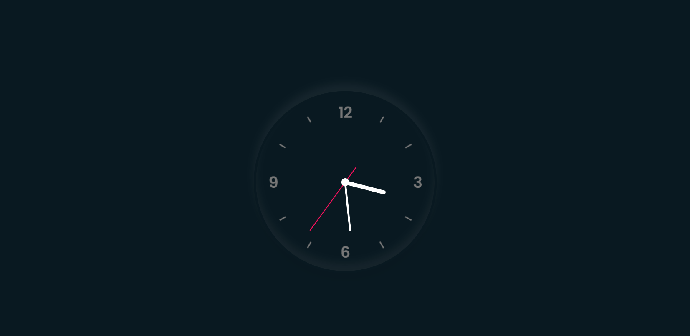

# Dark clock js

This is a Dark clock js

 

# Overview

 

# Links

   1 - [Github](https://github.com/Tiago-Rodrigs/Javascript-Clock)

   2 - [Live demo](https://clockjss.netlify.app/)
   
   3 - [Design]()

 

# Technologies used

* HTML
* CSS
* JAVASCRIPT
